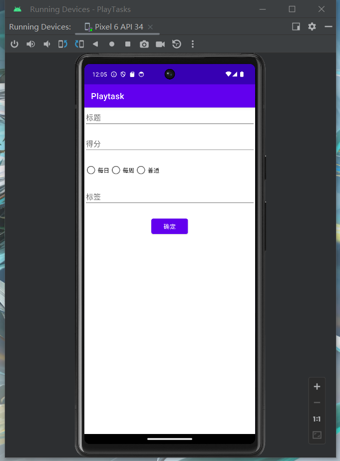
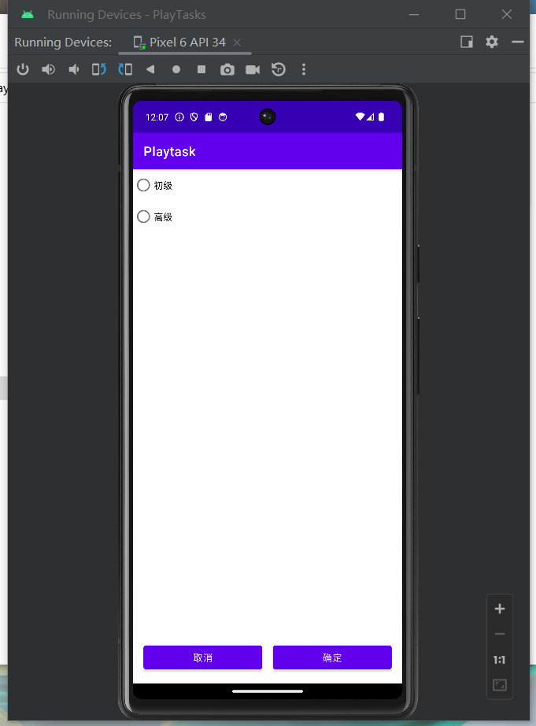
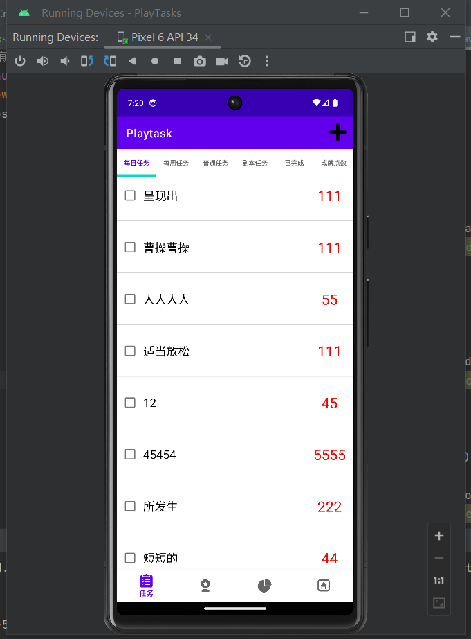
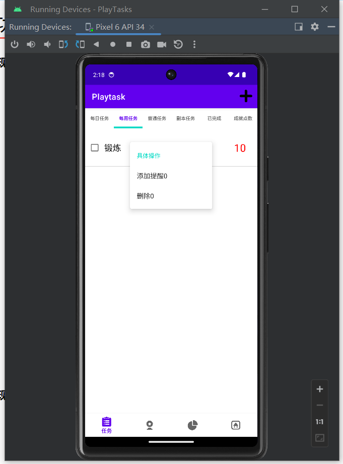
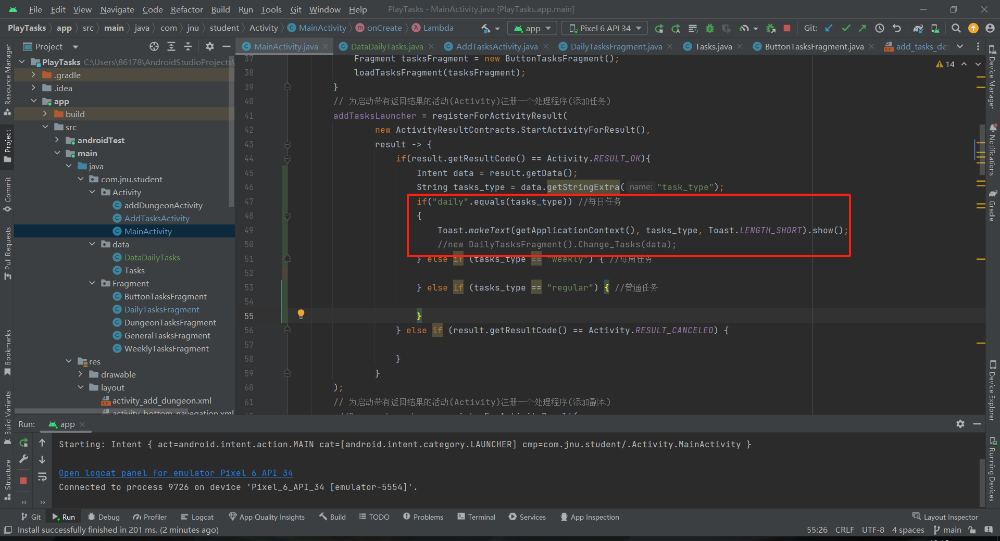
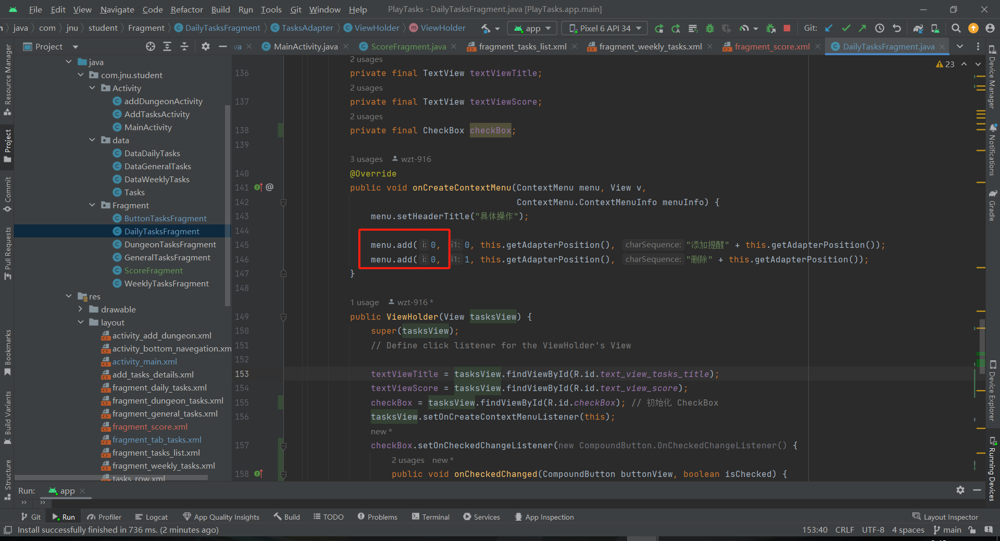
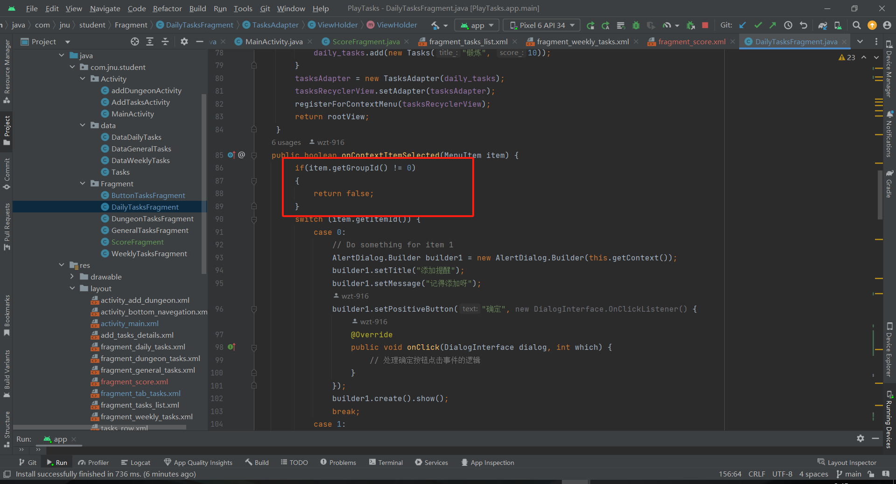

# Playtask
开发Playtask软件：

## Playtask界面

##### Playtask界面：任务栏的TabLayout布局

##### Playtask界面：底部导航栏

##### Playtask界面：底部导航栏(任务)与TabLayout布局

##### Playtask界面：各种任务页面的实现显示

##### Playtask界面：右上角角标添加

##### Playtask界面：右上角角标添加点击后跳转新的页面

添加任务：

加入副本：

## Playtask功能

##### Playtask功能：实现添加任务功能

##### Playtask功能：实现添加任务功能

##### Playtask功能：实现删除任务功能

## 错误记录

#### **实现底部导航栏**

在 `switch` 语句中处理底部导航栏的 ID 出现错误，可能是由于 ID 不匹配或者处理逻辑出现了问题：

将switch语句改成if语句即可：

#### 字符串比较

在Java中，字符串比较时应该使用`equals()`方法而不是`==`运算符。`==`比较的是对象的引用是否相同，而`equals()`比较的是字符串的内容是否相同。

##### 删除页面不对应

在“每周任务”删除数据，结果“每日任务”的任务被删除了。

排查后发现，每个menu都有属于自己的id号，如图：

因此在处理菜单的时候，需要获取当前的menu的id：

