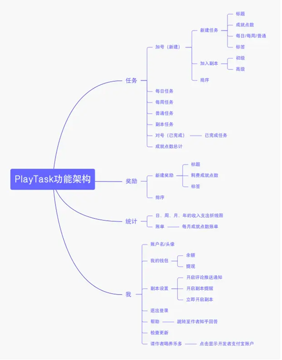
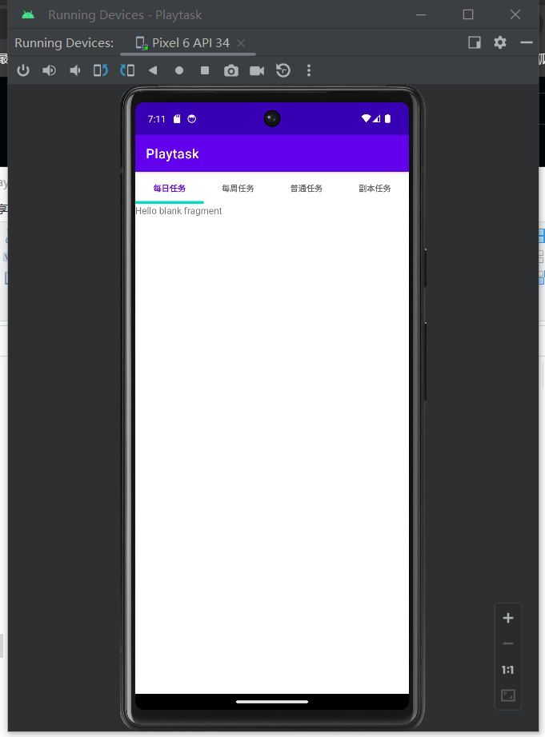
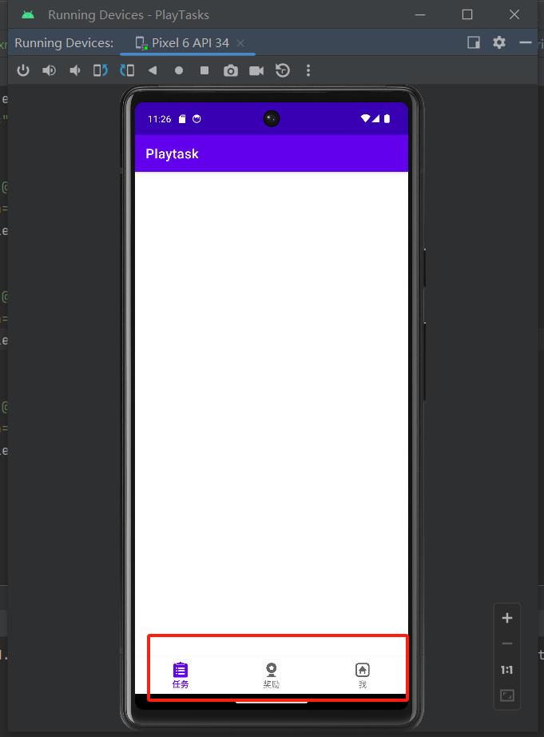
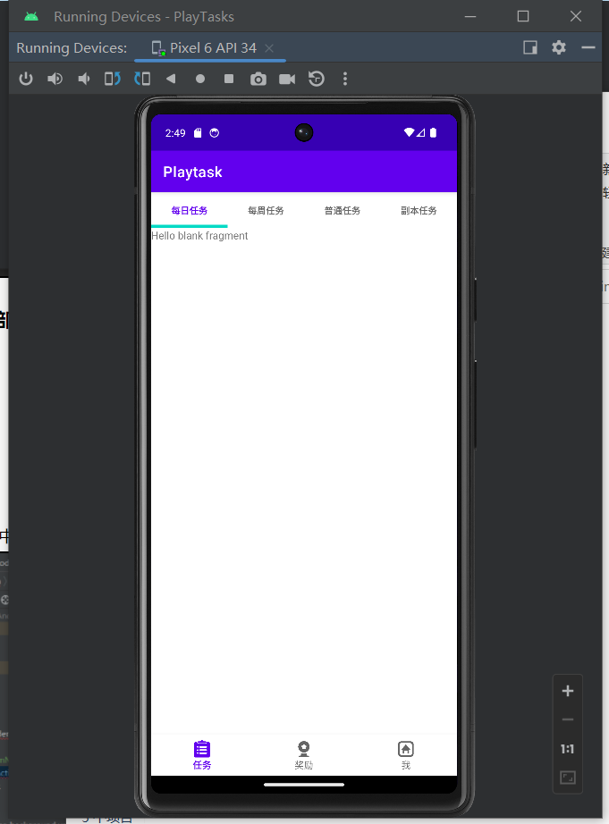
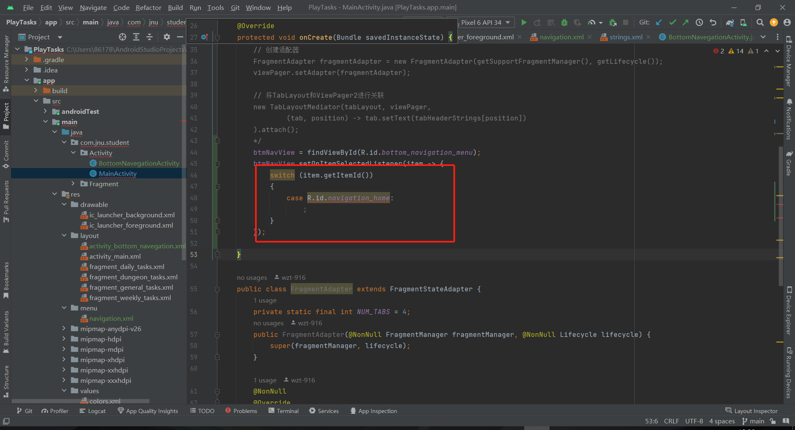
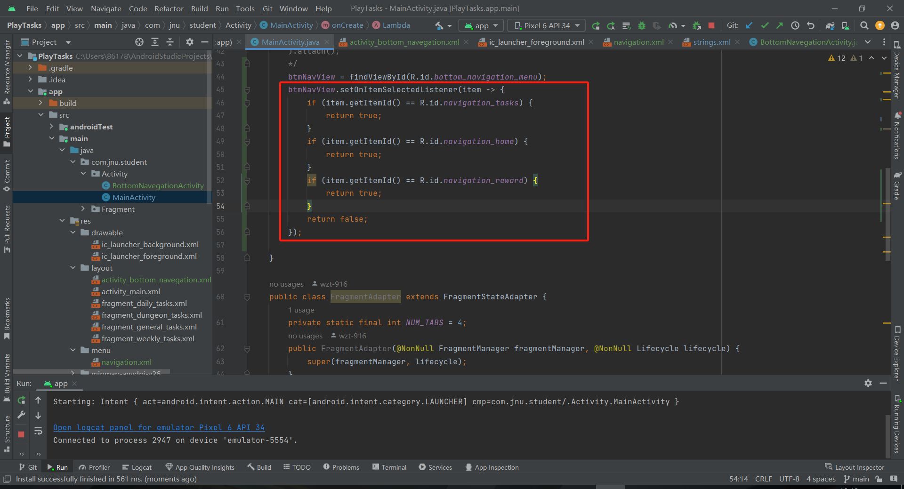

# Playtask
开发Playtask软件：

## Playtask界面

##### Playtask界面：任务栏的TabLayout布局

##### Playtask界面：底部导航栏

##### Playtask界面：底部导航栏(任务)与TabLayout布局

## 错误记录

1. 实现底部导航栏

   在 `switch` 语句中处理底部导航栏的 ID 出现错误，可能是由于 ID 不匹配或者处理逻辑出现了问题：

   

   将switch语句改成if语句即可：

   

   
